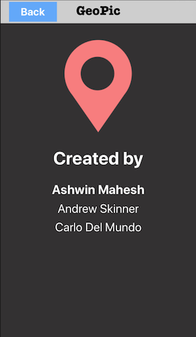

<h1> GeoPic </h1>

<h3>GeoPic is an iOS app that was made to mimic Instagram and use Core Location. Users can upload images, and view images posted by other users. When a user posts, the app automatically detects where the user is, and places an annotation on the map at that spot. Users can then open the map and see where all users have posted. By selecting one of these annotations, they can then see what was posted at that spot. This app also includes image upload and download to and from a Python/Django server using Alamofire. Users can also search for posts by poster name, username, or even location! This app also includes full login and registration.</h3>

HOW TO USE APP:

1) Open IP_ADDRESS.swift
2) Change IP to equal your local IP.

 
 
 
 
